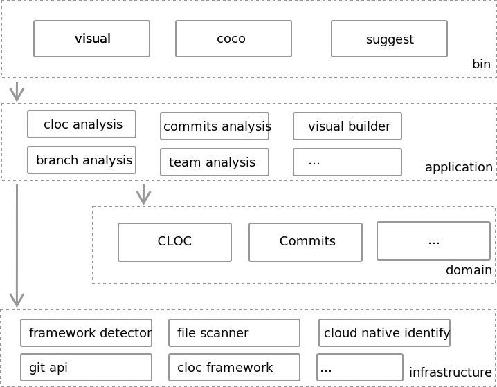

## Development

**IDE**: [Clion](https://www.jetbrains.com/clion/) (Recommended) / [IntelliJ](https://www.jetbrains.com/idea/) + [IntelliJ Rust plugin](https://intellij-rust.github.io/)

**Rust**: Verison >= 1.49.0 

**Ctags**

If you already have older version installed ,please update Rust version by:
```
rustup update
```

### Setup

1.install Rust

follow [https://www.rust-lang.org/tools/install](https://www.rust-lang.org/tools/install)

2.install `justfile`

follow: [https://github.com/casey/just](https://github.com/casey/just)

3.run tests

```
just tests
```

4.test command

```
cargo run --bin coco
```

#### Setup for Windows Subsystem for Linux (Debian)

1. install rust

```
apt-get install curl
curl --proto '=https' --tlsv1.2 -sSf https://sh.rustup.rs | sh
```

2. install just

```
cargo install just
```

3. install dependency package

```
sudo apt-get install gcc cmake g++ pkg-config libssl-dev 
sudo apt-get install libfreetype6-dev expat libxml2 libasound2-dev libexpat1-dev libxcb-composite0-dev
```

4. Run tests

```
just tests
```

#### Setup for macOS with HomeBrew

1. install rust

```
brew install rustup
rustup-init
```
restart shell，or execute ``` source $HOME/.cargo/env ```


2. install just

```
brew install just
```

3. build plugin
```
cargo build --all
```

4. Run tests

```
just tests
```

### Architecture



### Install Ctags

Ubuntu

```
sudo snap install universal-ctags
```

macOS

```
brew update
brew install --HEAD universal-ctags/universal-ctags/universal-ctags
```

Windows

```
choco install universal-ctags
```

Test with version commands

```
Universal Ctags 5.9.0(d532b5c), Copyright (C) 2015 Universal Ctags Team
Universal Ctags is derived from Exuberant Ctags.
Exuberant Ctags 5.8, Copyright (C) 1996-2009 Darren Hiebert
  Compiled: Feb 20 2021, 15:16:39
  URL: https://ctags.io/
  Optional compiled features: +wildcards, +regex, +iconv, +option-directory, +xpath, +case-insensitive-filenames, +packcc
```

### Contribute

we need you coding in TDD. You can use this repo to learn TDD :
[rust-fizzbuzz](https://github.com/jtong/rust-fizzbuzz)

## Release

use [conventional-changelog-cli](https://github.com/conventional-changelog/conventional-changelog/tree/master/packages/conventional-changelog-cli) for generate CHANGELOG

```
npm install -g conventional-changelog-cli
conventional-changelog -p angular -i CHANGELOG.md -s
```
